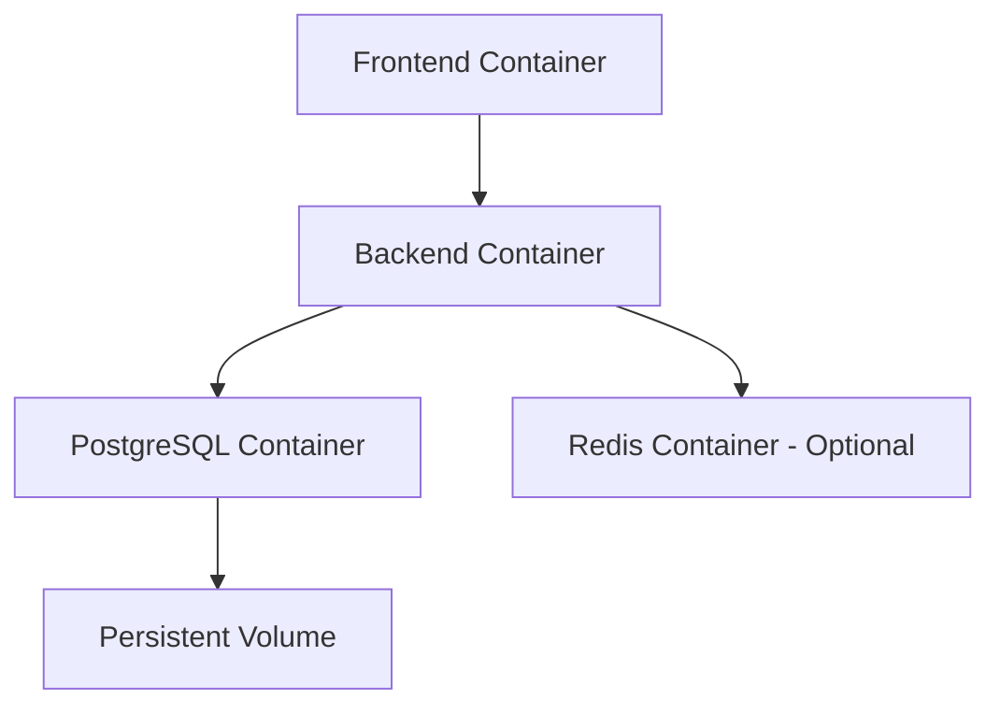

# 🐳 Docker Deployment Guide

Complete guide for deploying TaskFlow using Docker and Docker Compose - the recommended production deployment method.

## 🎯 Why Docker?

Docker provides the most reliable and consistent deployment experience for TaskFlow:

- ✅ **Consistent Environment** - Same setup across development, staging, and production
- ✅ **Easy Scaling** - Scale individual services independently
- ✅ **Isolated Dependencies** - No conflicts with host system
- ✅ **Quick Setup** - Get running in minutes, not hours
- ✅ **Production Ready** - Battle-tested containerization

---

## 🚀 Quick Start (5 Minutes)

### Prerequisites
- Docker 20.0+ and Docker Compose 2.0+
- 2GB+ available RAM
- 5GB+ available disk space

### One-Command Deployment
```bash
# Clone and start everything
git clone https://github.com/yourusername/taskflow.git
cd taskflow
docker-compose up -d

# Access your application
echo "🎉 TaskFlow is running!"
echo "Frontend: http://localhost:5173"
echo "Backend API: http://localhost:3000"
echo "Database: localhost:5432"
```

That's it! TaskFlow is now running with:
- React frontend on port 5173
- NestJS backend on port 3000
- PostgreSQL database on port 5432
- Real-time WebSocket connections

---

## 📁 Docker Architecture

### Container Structure
```
┌─────────────────────────────────────────────────────────────┐
│                    TaskFlow Docker Stack                    │
├─────────────────┬─────────────────┬─────────────────────────┤
│   Frontend      │    Backend      │      Database           │
│   (React)       │   (NestJS)      │    (PostgreSQL)         │
│                 │                 │                         │
│ Port: 5173      │ Port: 3000      │ Port: 5432              │
│ Volume: ./src   │ Volume: ./src   │ Volume: postgres_data   │
│ Hot Reload: ✅   │ Hot Reload: ✅   │ Persistent: ✅           │
└─────────────────┴─────────────────┴─────────────────────────┘
```

### Service Dependencies


---

## 🔧 Configuration Files

### docker-compose.yml (Development)
```yaml
version: '3.8'

services:
  # PostgreSQL Database
  postgres:
    image: postgres:15-alpine
    container_name: taskflow-db
    restart: unless-stopped
    environment:
      POSTGRES_USER: postgres
      POSTGRES_PASSWORD: password123
      POSTGRES_DB: taskflow_db
    ports:
      - "5432:5432"
    volumes:
      - postgres_data:/var/lib/postgresql/data
    networks:
      - taskflow-network
    healthcheck:
      test: ["CMD-SHELL", "pg_isready -U postgres"]
      interval: 10s
      timeout: 5s
      retries: 5

  # Backend NestJS API
  backend:
    build:
      context: ./taskflow-api
      dockerfile: Dockerfile
    container_name: taskflow-backend
    restart: unless-stopped
    environment:
      DB_HOST: postgres
      DB_PORT: 5432
      DB_USERNAME: postgres
      DB_PASSWORD: password123
      DB_DATABASE: taskflow_db
      JWT_SECRET: super-secret-jwt-key-change-in-production
      FRONTEND_URL: http://localhost:5173
    ports:
      - "3000:3000"
    depends_on:
      postgres:
        condition: service_healthy
    networks:
      - taskflow-network
    volumes:
      - ./taskflow-api:/app
      - /app/node_modules

  # Frontend React Application
  frontend:
    build:
      context: ./taskflow-frontend
      dockerfile: Dockerfile
    container_name: taskflow-frontend
    restart: unless-stopped
    environment:
      VITE_API_URL: http://localhost:3000
      VITE_WS_URL: ws://localhost:3000
    ports:
      - "5173:5173"
    depends_on:
      - backend
    networks:
      - taskflow-network
    volumes:
      - ./taskflow-frontend:/app
      - /app/node_modules

volumes:
  postgres_data:

networks:
  taskflow-network:
    driver: bridge
```

### docker-compose.prod.yml (Production)
```yaml
version: '3.8'

services:
  # Nginx Reverse Proxy
  nginx:
    image: nginx:alpine
    container_name: taskflow-nginx
    restart: unless-stopped
    ports:
      - "80:80"
      - "443:443"
    volumes:
      - ./nginx.conf:/etc/nginx/nginx.conf
      - ./ssl:/etc/nginx/ssl
    depends_on:
      - frontend
      - backend
    networks:
      - taskflow-network

  # PostgreSQL Database
  postgres:
    image: postgres:15-alpine
    container_name: taskflow-db-prod
    restart: unless-stopped
    environment:
      POSTGRES_USER: ${POSTGRES_USER}
      POSTGRES_PASSWORD: ${POSTGRES_PASSWORD}
      POSTGRES_DB: ${POSTGRES_DB}
    volumes:
      - postgres_data:/var/lib/postgresql/data
      - ./backups:/backups
    networks:
      - taskflow-network
    healthcheck:
      test: ["CMD-SHELL", "pg_isready -U ${POSTGRES_USER}"]
      interval: 30s
      timeout: 10s
      retries: 3

  # Backend Production
  backend:
    build:
      context: ./taskflow-api
      dockerfile: Dockerfile.prod
    container_name: taskflow-backend-prod
    restart: unless-stopped
    environment:
      NODE_ENV: production
      DB_HOST: postgres
      DB_PORT: 5432
      DB_USERNAME: ${POSTGRES_USER}
      DB_PASSWORD: ${POSTGRES_PASSWORD}
      DB_DATABASE: ${POSTGRES_DB}
      JWT_SECRET: ${JWT_SECRET}
      FRONTEND_URL: ${FRONTEND_URL}
    depends_on:
      postgres:
        condition: service_healthy
    networks:
      - taskflow-network

  # Frontend Production
  frontend:
    build:
      context: ./taskflow-frontend
      dockerfile: Dockerfile.prod
    container_name: taskflow-frontend-prod
    restart: unless-stopped
    environment:
      VITE_API_URL: ${API_URL}
      VITE_WS_URL: ${WS_URL}
    depends_on:
      - backend
    networks:
      - taskflow-network

volumes:
  postgres_data:

networks:
  taskflow-network:
    driver: bridge
```

---

## 🏗️ Dockerfile Configurations

### Backend Dockerfile (Development)
```dockerfile
FROM node:20-alpine

# Set working directory
WORKDIR /app

# Copy package files
COPY package*.json ./

# Install dependencies
RUN npm install

# Copy source code
COPY . .

# Expose port
EXPOSE 3000

# Start development server with hot reload
CMD ["npm", "run", "start:dev"]
```

### Backend Dockerfile.prod (Production)
```dockerfile
# Build stage
FROM node:20-alpine AS builder

WORKDIR /app
COPY package*.json ./
RUN npm ci --only=production

COPY . .
RUN npm run build

# Production stage
FROM node:20-alpine AS production

WORKDIR /app

# Copy built application
COPY --from=builder /app/dist ./dist
COPY --from=builder /app/node_modules ./node_modules
COPY --from=builder /app/package*.json ./

# Create non-root user
RUN addgroup -g 1001 -S nodejs
RUN adduser -S nestjs -u 1001
USER nestjs

EXPOSE 3000

# Health check
HEALTHCHECK --interval=30s --timeout=3s --start-period=5s --retries=3 \
  CMD curl -f http://localhost:3000/health || exit 1

CMD ["node", "dist/main"]
```

### Frontend Dockerfile (Development)
```dockerfile
FROM node:20-alpine

WORKDIR /app

# Copy package files
COPY package*.json ./

# Install dependencies
RUN npm install

# Copy source code
COPY . .

# Expose port
EXPOSE 5173

# Start development server
CMD ["npm", "run", "dev", "--", "--host", "0.0.0.0"]
```

### Frontend Dockerfile.prod (Production)
```dockerfile
# Build stage
FROM node:20-alpine AS builder

WORKDIR /app
COPY package*.json ./
RUN npm ci

COPY . .
RUN npm run build

# Production stage
FROM nginx:alpine AS production

# Copy built files
COPY --from=builder /app/dist /usr/share/nginx/html

# Copy nginx configuration
COPY nginx.conf /etc/nginx/nginx.conf

# Create non-root user
RUN addgroup -g 1001 -S nginx
RUN adduser -S nginx -u 1001

EXPOSE 80

CMD ["nginx", "-g", "daemon off;"]
```

---

## 🚀 Deployment Commands

### Development Deployment
```bash
# Start all services
docker-compose up -d

# View logs
docker-compose logs -f

# Stop services
docker-compose down

# Rebuild and restart
docker-compose up -d --build

# Access database
docker-compose exec postgres psql -U postgres -d taskflow_db
```

### Production Deployment
```bash
# Create production environment file
cp .env.example .env.production

# Edit production variables
nano .env.production

# Deploy to production
docker-compose -f docker-compose.prod.yml up -d

# Check status
docker-compose -f docker-compose.prod.yml ps

# View production logs
docker-compose -f docker-compose.prod.yml logs -f
```

### Scaling Services
```bash
# Scale backend to 3 instances
docker-compose up -d --scale backend=3

# Scale with load balancer
docker-compose -f docker-compose.prod.yml up -d --scale backend=3
```

---

## 🔧 Environment Configuration

### .env.docker (Development)
```env
# Database
POSTGRES_USER=postgres
POSTGRES_PASSWORD=password123
POSTGRES_DB=taskflow_db

# Application
JWT_SECRET=development-jwt-secret-change-in-production
FRONTEND_URL=http://localhost:5173
API_URL=http://localhost:3000
WS_URL=ws://localhost:3000
```

### .env.production (Production)
```env
# Database
POSTGRES_USER=taskflow_prod_user
POSTGRES_PASSWORD=super-secure-production-password
POSTGRES_DB=taskflow_production

# Security
JWT_SECRET=cryptographically-secure-jwt-secret-32-chars-minimum

# URLs
FRONTEND_URL=https://your-domain.com
API_URL=https://api.your-domain.com
WS_URL=wss://api.your-domain.com

# Email
MAIL_HOST=smtp.gmail.com
MAIL_PORT=587
MAIL_USER=noreply@your-domain.com
MAIL_PASS=your-app-password

# OAuth
GOOGLE_CLIENT_ID=your-production-google-client-id
GOOGLE_CLIENT_SECRET=your-production-google-client-secret
GITHUB_CLIENT_ID=your-production-github-client-id
GITHUB_CLIENT_SECRET=your-production-github-client-secret
```

---

## 🔍 Monitoring and Maintenance

### Health Checks
```bash
# Check all services
docker-compose ps

# Check specific service health
docker-compose exec backend curl http://localhost:3000/health

# Database health
docker-compose exec postgres pg_isready -U postgres
```

### Log Management
```bash
# View all logs
docker-compose logs

# Follow specific service logs
docker-compose logs -f backend

# View last 100 lines
docker-compose logs --tail=100 frontend

# Export logs
docker-compose logs > taskflow-logs.txt
```

### Database Operations
```bash
# Backup database
docker-compose exec postgres pg_dump -U postgres taskflow_db > backup.sql

# Restore database
docker-compose exec -T postgres psql -U postgres taskflow_db < backup.sql

# Access database shell
docker-compose exec postgres psql -U postgres -d taskflow_db
```

---

## 🔒 Security Best Practices

### Production Security
```yaml
# docker-compose.prod.yml security additions
services:
  backend:
    security_opt:
      - no-new-privileges:true
    read_only: true
    tmpfs:
      - /tmp
    user: "1001:1001"
    
  postgres:
    security_opt:
      - no-new-privileges:true
    user: "999:999"
```

### Network Security
```yaml
networks:
  taskflow-network:
    driver: bridge
    ipam:
      config:
        - subnet: 172.20.0.0/16
```

### Secrets Management
```bash
# Use Docker secrets for production
echo "super-secure-password" | docker secret create postgres_password -
echo "jwt-secret-key" | docker secret create jwt_secret -
```

---

## 📊 Performance Optimization

### Resource Limits
```yaml
services:
  backend:
    deploy:
      resources:
        limits:
          cpus: '1.0'
          memory: 1G
        reservations:
          cpus: '0.5'
          memory: 512M
          
  postgres:
    deploy:
      resources:
        limits:
          cpus: '1.0'
          memory: 2G
        reservations:
          cpus: '0.5'
          memory: 1G
```

### Caching Layer
```yaml
# Add Redis for caching
redis:
  image: redis:7-alpine
  container_name: taskflow-redis
  restart: unless-stopped
  ports:
    - "6379:6379"
  volumes:
    - redis_data:/data
  networks:
    - taskflow-network
```

---

## 🚨 Troubleshooting

### Common Issues

**Port Already in Use:**
```bash
# Find process using port
lsof -i :3000

# Kill process
kill -9 <PID>

# Or change port in docker-compose.yml
ports:
  - "3001:3000"  # Host:Container
```

**Database Connection Failed:**
```bash
# Check database logs
docker-compose logs postgres

# Verify database is healthy
docker-compose exec postgres pg_isready -U postgres

# Reset database
docker-compose down -v
docker-compose up -d
```

**Build Failures:**
```bash
# Clear Docker cache
docker system prune -a

# Rebuild without cache
docker-compose build --no-cache

# Check Dockerfile syntax
docker build -t test ./taskflow-api
```

**Memory Issues:**
```bash
# Check container resource usage
docker stats

# Increase Docker memory limit
# Docker Desktop > Settings > Resources > Memory
```

---

## 🔄 Updates and Maintenance

### Updating TaskFlow
```bash
# Pull latest changes
git pull origin main

# Rebuild and restart
docker-compose down
docker-compose up -d --build

# Run database migrations
docker-compose exec backend npm run migration:run
```

### Backup Strategy
```bash
#!/bin/bash
# backup.sh - Automated backup script

DATE=$(date +%Y%m%d_%H%M%S)
BACKUP_DIR="./backups"

# Create backup directory
mkdir -p $BACKUP_DIR

# Backup database
docker-compose exec -T postgres pg_dump -U postgres taskflow_db > $BACKUP_DIR/db_$DATE.sql

# Backup uploaded files
docker cp taskflow-backend:/app/uploads $BACKUP_DIR/uploads_$DATE

# Compress backups
tar -czf $BACKUP_DIR/taskflow_backup_$DATE.tar.gz $BACKUP_DIR/db_$DATE.sql $BACKUP_DIR/uploads_$DATE

echo "Backup completed: taskflow_backup_$DATE.tar.gz"
```

---

## 🌐 Cloud Deployment

### AWS ECS
```bash
# Build and push to ECR
aws ecr get-login-password --region us-east-1 | docker login --username AWS --password-stdin <account>.dkr.ecr.us-east-1.amazonaws.com

docker build -t taskflow-backend ./taskflow-api
docker tag taskflow-backend:latest <account>.dkr.ecr.us-east-1.amazonaws.com/taskflow-backend:latest
docker push <account>.dkr.ecr.us-east-1.amazonaws.com/taskflow-backend:latest
```

### Google Cloud Run
```bash
# Build and deploy
gcloud builds submit --tag gcr.io/PROJECT-ID/taskflow-backend ./taskflow-api
gcloud run deploy --image gcr.io/PROJECT-ID/taskflow-backend --platform managed
```

### DigitalOcean App Platform
```yaml
# .do/app.yaml
name: taskflow
services:
- name: backend
  source_dir: taskflow-api
  github:
    repo: your-username/taskflow
    branch: main
  run_command: npm start
  environment_slug: node-js
  instance_count: 1
  instance_size_slug: basic-xxs
```

---

<div align="center">
  <h2>🎉 Docker Deployment Complete!</h2>
  <p>Your TaskFlow application is now running in containers</p>
  <p>🔗 <strong>Frontend:</strong> http://localhost:5173</p>
  <p>🔗 <strong>Backend:</strong> http://localhost:3000</p>
  <p>🔗 <strong>Database:</strong> localhost:5432</p>
</div>